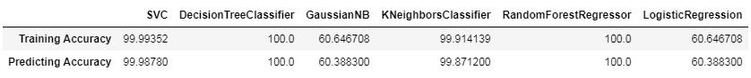

# Starbucks-offer-optimization
Offer optimization using machine learning techniques with Starbucks dataset.

# Files:
Starbucks.ipynb : contains code  
data/portfolio.json : contains offers metadata  
data/profile.json : contains customers metadata  
data/transcript.json : contains interaction customer-offers  

# How to Run
You can run this ipynb with jupyter notebook or take it to Google Colab.
 
#Results

 
# Blog 
https://medium.com/@prashantjadiya/offer-optimization-using-machine-learning-46a1f5d1b59b
